<p align="center">
  
  
</p>

<!--START_SECTION:waka-->


**I'm a Night 🦉** 

```text
🌞 Morning                74 commits          █░░░░░░░░░░░░░░░░░░░░░░░░   04.41 % 
🌆 Daytime                521 commits         ████████░░░░░░░░░░░░░░░░░   31.05 % 
🌃 Evening                754 commits         ███████████░░░░░░░░░░░░░░   44.93 % 
🌙 Night                  329 commits         █████░░░░░░░░░░░░░░░░░░░░   19.61 % 
```
📅 **I'm Most Productive on Friday** 

```text
Monday                   156 commits         ██░░░░░░░░░░░░░░░░░░░░░░░   09.30 % 
Tuesday                  137 commits         ██░░░░░░░░░░░░░░░░░░░░░░░   08.16 % 
Wednesday                355 commits         █████░░░░░░░░░░░░░░░░░░░░   21.16 % 
Thursday                 280 commits         ████░░░░░░░░░░░░░░░░░░░░░   16.69 % 
Friday                   392 commits         ██████░░░░░░░░░░░░░░░░░░░   23.36 % 
Saturday                 235 commits         ████░░░░░░░░░░░░░░░░░░░░░   14.00 % 
Sunday                   123 commits         ██░░░░░░░░░░░░░░░░░░░░░░░   07.33 % 
```


📊 **This Week I Spent My Time On** 

```text
🕑︎ Time Zone: Asia/Hong_Kong

💻 Operating System: 
Linux                    13 hrs 3 mins       █████████████████████████   100.00 % 
```


 Last Updated on 19/10/2024 18:43:45 UTC
<!--END_SECTION:waka-->
